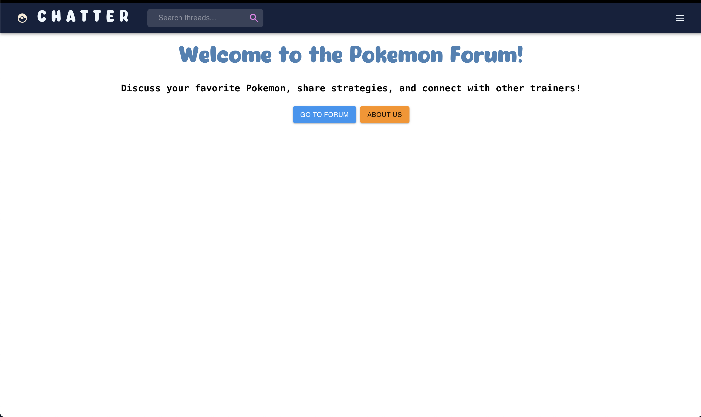

# frying-fuses

## Table of Contents

<!-- - [Roadmap](#roadmap) -->
- [Installation](#installation)
- [Usage](#usage)
- [Acknowledgements](#acknowledgements)
<!--- [TODO](#todo) -->
<!--
## Roadmap -- completed

1. Complete backend

   1. models

   2. controllers & serializers & routes

   3. authentication

   4. assosciations

2. Complete frontend

   1. Utilise mui library

   2. Organise the file structure

   3. Check routes
-->

## Installation

Rails version: 7.1.2

Ruby version: 3.2.2

1. [Clone](https://docs.github.com/en/get-started/getting-started-with-git/about-remote-repositories) this repo 

```bash
git clone https://github.com/wes-w-z-h/frying-fuses.git
```

2. Install dependencies in the appropriate folders 

Install frontend dependencies

```bash
cd frontend/
```

```bash
yarn install
```

Install backend dependancies

```bash
cd backend/
```

```bash
bundle install
```

Setup the database

```bash
rails db:migrate
```

Seed the database:

```bash
rails db:seed
```

## Usage


1. To fire the server run:
```bash
rails s -p 3001
```

2. To start the frontend server run:

```bash
yarn start
```

3. Open [http://localhost:3000](http://localhost:3000) to view it in the browser.

4. You should see a page like this.


5. To open the rails console

```bash
rails c
```

## Acknowledgements

This project was bootstrapped with [Create React App](https://github.com/facebook/create-react-app).

This project uses [MUI](https://mui.com/), [ESLint](https://eslint.org/), [Prettier](https://prettier.io/).

<!--
~~## TODO~~

~~1. [x] Create Category & Topics model/controllers/routes~~
~~2. [x] Create Posts model/controller/routes~~
~~3. [x] Working optional password~~
~~4. [x] Authentication~~
~~5. [x] Dashboard~~
~~6. [x] Render topics~~
~~7. [x] Add post functionality to frontend~~

~~### In Progress~~

~~1. [x] hooks to generate content on the page~~
~~2. [x] resize the images~~
~~3. [x] topics layout~~
~~4. [x] start posts page & components~~
~~5. [x] add validation for editing & deleting posts~~
~~6. [x] add the logout timer + countdown~~
-->
